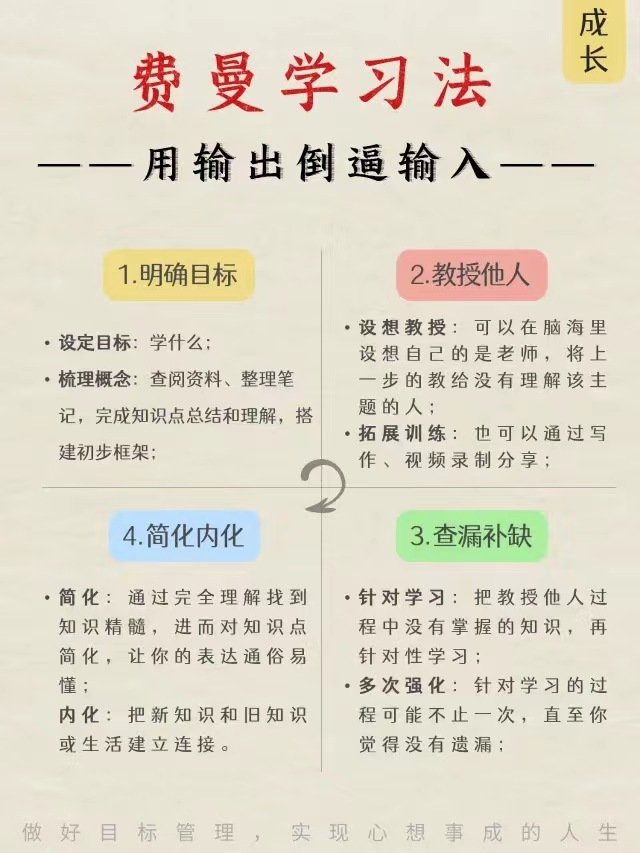

费曼学习法
======

用输出倒逼输入

## 1.明确目标
### 设定目标
学什么

### 梳理概念
查阅资料、整理笔记，完成知识点总结和理解，搭建初步框架

## 2.教授他人
### 设想教授
可以在脑海里设想自己是老师，将上一步的教给没有理解该主题的人

### 扩展训练
可以通过写作、视频录制分享

## 3.查漏补缺
### 针对学习
把教授他人过程中没有掌握的知识，再针对性学习

### 多次强化
针对学习的过程可能不止一次，直至你觉得没有遗漏

## 4.简化内化
### 简化
通过完全理解找到知识精髓，进而对知识点简化，让你的表达通俗易懂

### 内化
把新知识和旧知识或生活建立连接

