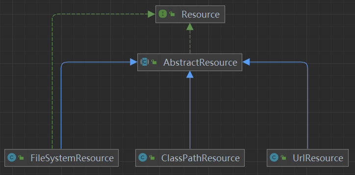
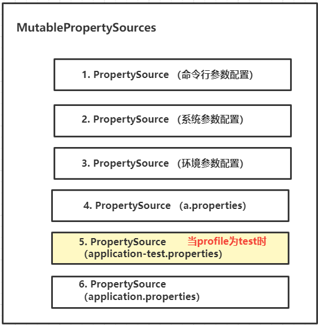

深入Spring配置内核，感受抽象的力量
======
> 张建飞（Frank）
> [原文链接](https://blog.csdn.net/significantfrank/article/details/128245998)


我在《程序员的底层思维》中说过，**抽象思维**是程序员必须要掌握的**重要思维能力**。**好的软件设计离不开抽象和抽象层次的权衡**。
比如你说配置就是properties文件，这个抽象层次就很低，因为yaml也可以是配置文件。**好的抽象**能为系统提供必要的**扩展性和可维护性**。

本文通过**深入剖析Spring配置的抽象设计**，以及讲解**这套抽象是如何支撑Spring，以及持续支撑SpringBoot和Spring Cloud Config的功能扩展**。
带你一起感受**抽象的力量**。


# 1. Spring配置内核
假设现在要让你实现一个类似于**Spring的配置框架，你会如何设计**？
所谓配置是一种通过调整参数，在不改动软件代码的情况下，改变系统行为的方式。所有的配置系统，都需要做三件事情：

1. **配置内容获取**： 获取**配置内容**，是配置系统要做的第一件事情。配置内容（通常是以配置文件的形式）可以从classpath，文件系统或者网络字节流获取。

2. **配置内容解析**： 拿到配置内容之后，需要对**配置内容**进行解析。因为配置可能存在多种不同的格式，比如常见的配置文件格式包括properties，yaml，JSON，XML等等。

3. **配置项赋值**： 最后，就是要给**配置项**赋值。在赋值的过程中，当一个配置项存在于多个配置定义中时，需要有**优先级处理规则**。

要想实现这样的功能，框架必须要具备一定的灵活性和扩展性。一定要设计得足够抽象，不能写死。
比如关于文件格式你如果写死为properties，就没办法支持yaml和xml了。
要让**设计**满足这样的**灵活性，有三个核心抽象**，你必须要了解，**这三个抽象分别是Resource抽象，PropertySource抽象，以及PropertySources抽象**。


## 1.1 配置内容获取：Resource抽象
**配置内容**可能来源于多个不同的地方，可能是文件，也可能不是。
**所以我们需要一个相对大的概念，来统合这些差异性，Resource**是个不错的选择，因为它能屏蔽配置内容来源、及格式的差异性。
因为这个抽象程度比较高，所以共性就只剩下对外部资源字节流的获取了。
如下所示，我们在Resource抽象中只定义了getInputStream()来获取字节输入流。

```java
public interface Resource {
    //核心抽象
    InputStream getInputStream() throws IOException;
    //...
}
```

不同类型的Resource意味着获取字节流的方式会不一样，比如ClassPathResource是从ClassPath获取文件。
```java
public class ClassPathResource implements Resource {
 
    @Override
    public InputStream getInputStream() throws IOException {
        InputStream is = ClassLoader.getSystemResourceAsStream(this.path);
        if (is == null) {
            throw new FileNotFoundException(this.path + " cannot be opened because it does not exist");
        }
        return is;
    }
    //...
}
```
而FileSystemResource是从文件系统获得字节流。
```java
public class FileSystemResource implements Resource {
 
    @Override
    public InputStream getInputStream() throws IOException {
        try {
            return Files.newInputStream(this.filePath);
        }
        catch (NoSuchFileException ex) {
            throw new FileNotFoundException(ex.getMessage());
        }
    }
    //...
}
```

Spring的Resource正是如此设计的，除了支持文件的Resource之外，它还会支持很多其它种类的Resource。
**关键是Resource足够抽象，所有的资源**（本地文件也好，远程文件也罢），**只要有URL（Uniform Resource Locator）就能被获取**。



## 1.2 配置内容解析：PropertySource抽象
**Resource是对配置内容来源的抽象**，那么对**配置本身**，我们还需要一个抽象。
这个抽象需要**磨平不同的配置内容格式**，即不管你的配置文件是properties、yaml还是json，格式有所不同，但**解析之后不应该存在差异**。
这里的**抽象很关键，需要深入思考配置内容的本质是什么**。**配置的本质是给配置项赋值**，**不管其外在形式如何，其本质形式就是一组key-value pair**。
**Spring对这一组key-value pair的抽象**叫**PropertySource**，其核心方法就是通过配置名称找到配置内容。

```java
public abstract class PropertySource<T> {
    protected final String name;
    protected final T source;
 
    //配置的核心无外乎就是通过name，找到配置内容
    public abstract Object getProperty(String name);
 
    //...
}
```

上面已经说过了，**配置本质上就是key-value pair**，那么用HashMap数据结构存储配置内容是再适合不过的了。
实际上Spring也是这么做的，你可以认为**MapPropertySource**就是**对Map的更有业务语义的封装**。
```java
public class MapPropertySource extends PropertySource<Map<String, String>> {
 
    public MapPropertySource(String name, Map<String, String> source) {
        super(name, source);
    }
 
    @Override
    public Object getProperty(String name) {
        return this.source.get(name);
    }
 
    //...
}
```

针对不同的配置文件类型，采用不同的解析方式，我们就能得到统一的PropertySource。
例如配置文件是properties格式，我们就可以用PropertiesPropertySourceLoader来做文件解析：
```
PropertySourceLoader loader = new PropertiesPropertySourceLoader();
Resource resource = new ClassPathResource("mycfg.properties");
PropertySource ps = loader.load("MyConfigFile", resource).get(0);
```
如果是yaml格式，就可以用YamlPropertySourceLoader来做文件解析：
```
PropertySourceLoader loader = new YamlPropertySourceLoader();
Resource resource = new FilePathResource("D:/myapp/mycfg.yml");
PropertySource ps = loader.load("MyConfigFile", resource).get(0);
```

这样，通过Resource和PropertySource这两个抽象，我们就能**把在任何地方的配置，任何形式的配置，转换成可以统一处理的对象——PropertySource**。


## 1.3 配置项赋值：PropertySources
最后是给**配置项**赋值，赋值本身不难，困难的是**要解决各种配置冲突问题**。
比如**环境不同可能引发冲突**，一个配置项我定义了test测试环境和production生成环境，如果当前是test环境就应该让test的配置生效，如果不是则应该让生成环境生效，
再比如，一个配置项我在a.properties里面定义了，在application.properties里面也定义了，我希望让a.properties里面定义的**优先级**更高等等。

看起来好像很复杂，其实归根到底就是**一个优先级的问题**。我们可以把每一个**配置源**都当成一个**PropertySource**。
那么**多个配置源**当然就是**一系列PropertySource的集合**，所以需要**一个表示集合的抽象——PropertySources**。
在Spring中，其具体实现是**MutablePropertySources**代表了**一组PropertySource列表**（如下图所示），
**在列表中排在最前面的优先级最高。然后在获取配置项值的时候，从该列表的的第一个PropertySource开始遍历，找到匹配的就退出，这样就解决了冲突问题**。
这也是为什么将其命名为Mutable的原因，immutable是不可变的，而mutable是可变的，而这里恰恰是**利用了列表的有序性和可变性，优雅的解决了优先级问题**。



关于这个优先级处理的代码，可以查看PropertySourcesPropertyResolver的getProperty方法，
其逻辑就是遍历MutablePropertySources里的PropertySource列表。找到第一个匹配的，然后立马return返回。
看起来很复杂的配置冲突场景，就是通过这个简单的机制解决的。
```
    protected <T> T getProperty(String key, Class<T> targetValueType, boolean resolveNestedPlaceholders) {
        if (this.propertySources != null) {
            //遍历
            for (PropertySource<?> propertySource : this.propertySources) {     
                Object value = propertySource.getProperty(key);
                if (value != null) {
                    if (resolveNestedPlaceholders && value instanceof String) {
                        value = resolveNestedPlaceholders((String) value);
                    }
                    logKeyFound(key, propertySource, value);
                    //退出
                    return convertValueIfNecessary(value, targetValueType);
                }
            }
        }
        return null;
    }
```

根据这个机制，我们可以通过自定义的方式来控制**配置生效的优先级**。
如下所示，只要我们控制**PropertySource在MutablePropertySources中的位置**，就能控制配置的优先级：
```
MutablePropertySources propertySources = environment.getPropertySources();
Resource resource = new ClassPathResource("mycfg.properties");
PropertySource ps = loader.load("MyCfg", resource).get(0);
 
/**通过addFirst提高优先级，因为这样新PropertySource会排在前面 **/
propertySources.addFirst(ps);
 
/**通过addLast降低优先级，因为这样新PropertySource会排在后面 **/
propertySources.addLast(ps);
```


# 2. Spring配置应用
通过上面的介绍，我相信你对**Spring的核心运作机制**应该已经很清楚了，
接下来让我们看看**这套机制是如何支撑Spring、Spring Boot、以及Spring Cloud的配置工作的**。

## 2.1 Spring配置
让我们先从简单的开始，先看一个Spring配置的例子。如下所示，我们可以在标注了@Configuration的类上，通过@PropertySource来指定配置文件（比如classpath下的cfg.properties），然后通过@Value("${nickname}")给配置项赋值。


