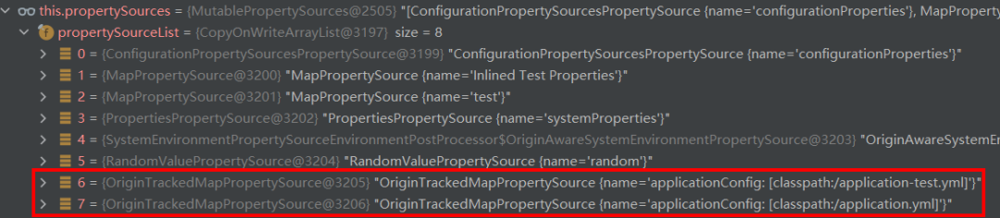

深入Spring配置内核，感受抽象的力量
======
> 张建飞（Frank），2022-12-09
> [原文链接](https://blog.csdn.net/significantfrank/article/details/128245998)


我在《程序员的底层思维》中说过，**抽象思维**是程序员必须要掌握的**重要思维能力**。**好的软件设计离不开抽象和抽象层次的权衡**。
比如你说配置就是properties文件，这个抽象层次就很低，因为yaml也可以是配置文件。**好的抽象**能为系统提供必要的**扩展性和可维护性**。

本文通过**深入剖析Spring配置的抽象设计**，以及讲解**这套抽象是如何支撑Spring，以及持续支撑SpringBoot和Spring Cloud Config的功能扩展**。
带你一起感受**抽象的力量**。


# 1. Spring配置内核
假设现在要让你实现一个类似于**Spring的配置框架，你会如何设计**？
所谓配置是一种通过调整参数，在不改动软件代码的情况下，改变系统行为的方式。所有的配置系统，都需要做三件事情：

1. **配置内容获取**： 获取**配置内容**，是配置系统要做的第一件事情。配置内容（通常是以配置文件的形式）可以从classpath，文件系统或者网络字节流获取。

2. **配置内容解析**： 拿到配置内容之后，需要对**配置内容**进行解析。因为配置可能存在多种不同的格式，比如常见的配置文件格式包括properties，yaml，JSON，XML等等。

3. **配置项赋值**： 最后，就是要给**配置项**赋值。在赋值的过程中，当一个配置项存在于多个配置定义中时，需要有**优先级处理规则**。

要想实现这样的功能，框架必须要具备一定的灵活性和扩展性。一定要设计得足够抽象，不能写死。
比如关于文件格式你如果写死为properties，就没办法支持yaml和xml了。
要让**设计**满足这样的**灵活性，有三个核心抽象**，你必须要了解，**这三个抽象分别是Resource抽象，PropertySource抽象，以及PropertySources抽象**。


## 1.1 配置内容获取：Resource抽象
**配置内容**可能来源于多个不同的地方，可能是文件，也可能不是。
**所以我们需要一个相对大的概念，来统合这些差异性，Resource**是个不错的选择，因为它能屏蔽配置内容来源、及格式的差异性。
因为这个抽象程度比较高，所以共性就只剩下对外部资源字节流的获取了。
如下所示，我们在Resource抽象中只定义了getInputStream()来获取字节输入流。

```java
public interface Resource {
    //核心抽象
    InputStream getInputStream() throws IOException;
    //...
}
```

不同类型的Resource意味着获取字节流的方式会不一样，比如ClassPathResource是从ClassPath获取文件。
```java
public class ClassPathResource implements Resource {
 
    @Override
    public InputStream getInputStream() throws IOException {
        InputStream is = ClassLoader.getSystemResourceAsStream(this.path);
        if (is == null) {
            throw new FileNotFoundException(this.path + " cannot be opened because it does not exist");
        }
        return is;
    }
    //...
}
```
而FileSystemResource是从文件系统获得字节流。
```java
public class FileSystemResource implements Resource {
 
    @Override
    public InputStream getInputStream() throws IOException {
        try {
            return Files.newInputStream(this.filePath);
        }
        catch (NoSuchFileException ex) {
            throw new FileNotFoundException(ex.getMessage());
        }
    }
    //...
}
```

Spring的Resource正是如此设计的，除了支持文件的Resource之外，它还会支持很多其它种类的Resource。
**关键是Resource足够抽象，所有的资源**（本地文件也好，远程文件也罢），**只要有URL（Uniform Resource Locator）就能被获取**。


## 1.2 配置内容解析：PropertySource抽象
**Resource是对配置内容来源的抽象**，那么对**配置本身**，我们还需要一个抽象。
这个抽象需要**磨平不同的配置内容格式**，即不管你的配置文件是properties、yaml还是json，格式有所不同，但**解析之后不应该存在差异**。
这里的**抽象很关键，需要深入思考配置内容的本质是什么**。**配置的本质是给配置项赋值**，**不管其外在形式如何，其本质形式就是一组key-value pair**。
**Spring对这一组key-value pair的抽象**叫**PropertySource**，其核心方法就是通过配置名称找到配置内容。

```java
public abstract class PropertySource<T> {
    protected final String name;
    protected final T source;
 
    //配置的核心无外乎就是通过name，找到配置内容
    public abstract Object getProperty(String name);
 
    //...
}
```

上面已经说过了，**配置本质上就是key-value pair**，那么用HashMap数据结构存储配置内容是再适合不过的了。
实际上Spring也是这么做的，你可以认为**MapPropertySource**就是**对Map的更有业务语义的封装**。
```java
public class MapPropertySource extends PropertySource<Map<String, String>> {
 
    public MapPropertySource(String name, Map<String, String> source) {
        super(name, source);
    }
 
    @Override
    public Object getProperty(String name) {
        return this.source.get(name);
    }
 
    //...
}
```

针对不同的配置文件类型，采用不同的解析方式，我们就能得到统一的PropertySource。
例如配置文件是properties格式，我们就可以用PropertiesPropertySourceLoader来做文件解析：
```
PropertySourceLoader loader = new PropertiesPropertySourceLoader();
Resource resource = new ClassPathResource("mycfg.properties");
PropertySource ps = loader.load("MyConfigFile", resource).get(0);
```
如果是yaml格式，就可以用YamlPropertySourceLoader来做文件解析：
```
PropertySourceLoader loader = new YamlPropertySourceLoader();
Resource resource = new FilePathResource("D:/myapp/mycfg.yml");
PropertySource ps = loader.load("MyConfigFile", resource).get(0);
```

这样，通过Resource和PropertySource这两个抽象，我们就能**把在任何地方的配置，任何形式的配置，转换成可以统一处理的对象——PropertySource**。


## 1.3 配置项赋值：PropertySources
最后是给**配置项**赋值，赋值本身不难，困难的是**要解决各种配置冲突问题**。
比如**环境不同可能引发冲突**，一个配置项我定义了test测试环境和production生成环境，如果当前是test环境就应该让test的配置生效，如果不是则应该让生成环境生效，
再比如，一个配置项我在a.properties里面定义了，在application.properties里面也定义了，我希望让a.properties里面定义的**优先级**更高等等。

看起来好像很复杂，其实归根到底就是**一个优先级的问题**。我们可以把每一个**配置源**都当成一个**PropertySource**。
那么**多个配置源**当然就是**一系列PropertySource的集合**，所以需要**一个表示集合的抽象——PropertySources**。
在Spring中，其具体实现是**MutablePropertySources**代表了**一组PropertySource列表**（如下图所示），
**在列表中排在最前面的优先级最高。然后在获取配置项值的时候，从该列表的的第一个PropertySource开始遍历，找到匹配的就退出，这样就解决了冲突问题**。
这也是为什么将其命名为Mutable的原因，immutable是不可变的，而mutable是可变的，而这里恰恰是**利用了列表的有序性和可变性，优雅的解决了优先级问题**。


关于这个优先级处理的代码，可以查看PropertySourcesPropertyResolver的getProperty方法，
其逻辑就是**遍历MutablePropertySources里的PropertySource列表。找到第一个匹配的，然后立马return返回**。
看起来很复杂的配置冲突场景，就是通过这个简单的机制解决的。
```
    protected <T> T getProperty(String key, Class<T> targetValueType, boolean resolveNestedPlaceholders) {
        if (this.propertySources != null) {
            //遍历
            for (PropertySource<?> propertySource : this.propertySources) {     
                Object value = propertySource.getProperty(key);
                if (value != null) {
                    if (resolveNestedPlaceholders && value instanceof String) {
                        value = resolveNestedPlaceholders((String) value);
                    }
                    logKeyFound(key, propertySource, value);
                    //退出
                    return convertValueIfNecessary(value, targetValueType);
                }
            }
        }
        return null;
    }
```

根据这个机制，我们可以通过自定义的方式来控制**配置生效的优先级**。
如下所示，只要我们控制**PropertySource在MutablePropertySources中的位置**，就能控制配置的优先级：
```
MutablePropertySources propertySources = environment.getPropertySources();
Resource resource = new ClassPathResource("mycfg.properties");
PropertySource ps = loader.load("MyCfg", resource).get(0);
 
/**通过addFirst提高优先级，因为这样新PropertySource会排在前面 **/
propertySources.addFirst(ps);
 
/**通过addLast降低优先级，因为这样新PropertySource会排在后面 **/
propertySources.addLast(ps);
```


# 2. Spring配置应用
通过上面的介绍，我相信你对**Spring的核心运作机制**应该已经很清楚了，
接下来让我们看看**这套机制是如何支撑Spring、Spring Boot、以及Spring Cloud的配置工作的**。

## 2.1 Spring配置
让我们先从简单的开始，先看一个Spring配置的例子。
如下所示，我们可以在标注了@Configuration的类上，通过@PropertySource来指定配置文件（比如classpath下的cfg.properties），然后通过@Value("${nickname}")给配置项赋值。
```java
@Configuration
@PropertySource({"classpath:cfg.properties"})
public class Config {
    @Value("${nickname}")
    private String nickName;
}
```
我们可以在cfg.properties里写入配置内容，比如nickname=xiao fei，然后运行下面程序，就能看到config的nickName被赋值为xiao fei。
```java
public class Main {
    public static void main(String[] args) {
        ApplicationContext context = new AnnotationConfigApplicationContext(Config.class);
        Config config = context.getBean(Config.class);
        System.out.println(config.getNickName());
    }
}
```
这里发生的事情，无外乎就是Spring在处理ConfigurationClass的时候，会处理PropertySource，
具体可以看ConfigurationClassParser.processPropertySource()这个方法，其部分代码如下所示：
```
// resolvedLocation is "classpath:cfg.properties"
String resolvedLocation = this.environment.resolveRequiredPlaceholders(location);
// 1. 获得Resource
Resource resource = this.resourceLoader.getResource(resolvedLocation);
// 2. 组装PropertySource
PropertySource propertySource = factory.createPropertySource(name, new EncodedResource(resource, encoding));
// 3. 通过addLast把PropertySource加入MutablePropertySources
propertySources.addLast(propertySource);
```
这里核心做的事情就是获得**Resource**、组装**PropertySource**，设置**MutablePropertySources**。
这正是我们在前文中介绍的三个重要抽象。


## 2.2 Spring Boot配置
**SpringBoot和Spring的配置机制**基本一样，只是增加了**约定胜于配置（Convention over Configuration）的理念**，它会自动去classpath下面加载application.properties（或者application.yml）。
所以在开发的时候，我们只要把需要配置的数据放在src/main/resources下的application.properties里面，整个系统就能run起来。

也就是说，我们在使用SpringBoot的时候，不再需要自己指定配置文件，使用默认机制就能完成配置功能。
```java
@Component
public class MyBean {
 
    @Value("${name}")
    private String name;
 
}
```
然后我们在application.yml里写入name: frank，然后写一段代码验证一下：
```java
@SpringBootTest
@RunWith(SpringRunner.class)
public class ConfigTest {
    @Resource
    private MyBean myBean;
 
    @Test
    public void test() {
        System.out.println(myBean.getName());
    }
}
```
不出意外，这个name将会被赋值为frank。接下来我们换一下运行方式，加上命令行参数：
```shell
java -jar app.jar --name="andy"
```
或者是在IDE里面，我们也可以直接加上一个新的环境变量name=andy。
不管是哪种方式，我们可以发现，MyBean里面的name已经不再是frank，而是变成了andy。
这就是我们在前文中所说，**通过MutablePropertySources实现的配置优先级机制**在起作用。
如果你去查看SpringBoot Configuration的官方文档，你会发现**SpringBoot配置的优先级从高到低的顺序**如下所示：

1. 最高优先级是命令行参数（java -jar app.jar --name="andy"）
2. Java系统参数（java -Dname="andy" -jar app.jar），可通过System.getProperties()获取。
3. 环境变量（export name=andy），可通过System.getenv()获取
4. 从特定profile获取（比如profile为test，会装载application-test.properties）
5. 从默认的application.properties（或者yaml）获取
6. 最低优先级的是从@PropertySource获取的配置

这个优先级的实现，就是利用了我们在1.3节中提到的**MutablePropertySources机制**。
关于这一点，我们不妨启动一个SpringBoot应用，设置了Active Profile为test，与此同时，在classpath下面同时放置application-test.yml和application.yml。
debug代码你会看到如下所示的 **MutablePropertySources**。



其中application-test.yml的PropertySource排在第6，application.yml的PropertySource排在第7，这说明application-test.yml的优先级更高，
如果一个配置项分别在两个文件中都定义的话，系统会优先使用application-test.yml中的配置。
当然因为系统参数和环境变量的PropertySource更靠前，因此，这些**配置项的优先级**更高。

不难看到，对于SpringBoot来说，除了增加了**约定胜于配置的机制**，其核心还是**Resource**、**PropertySource**，**MutablePropertySources**。


## 2.3 Spring Cloud Config
Spring Cloud Config致力于在分布式系统中，提供**外置配置**支持。接下来，我们先用Git做后端存储，实现一个简单的Spring Cloud Config**分布式配置**。


### 2.3.1 Config Server
首先在项目中加入spring-cloud-config-server的依赖，可以把以下片段加到Maven中。
```
<dependencyManagement>
  <dependencies>
    <dependency>
      <groupId>org.springframework.cloud</groupId>
      <artifactId>spring-cloud-dependencies</artifactId>
      <version>${spring-cloud.version}</version>
      <type>pom</type>
      <scope>import</scope>
    </dependency>
  </dependencies>
</dependencyManagement>
 
<dependencies>
  <dependency>
    <groupId>org.springframework.cloud</groupId>
    <artifactId>spring-cloud-config-server</artifactId>
  </dependency>
</dependencies>
```

在启动类上加上@EnableConfigServer，标识这是一个Config Server：
```java
@SpringBootApplication
@EnableConfigServer
public class ConfigServerApplication {
 
    public static void main(String[] args) {
        SpringApplication.run(ConfigServerApplication.class, args);
    }
 
}
```
在application.properties中加入config server的配置信息：
```properties
# 服务器端口
server.port=8888
# git地址，这个是在本地
spring.cloud.config.server.git.uri=file:///D:/code/courses/spring-cloud-config-git-repo
```
然后我们在git repo下面创建一个config-client.properties，并在里面加入配置信息my.nickName=three

启动ConfigServerApplication，然后访问http://localhost:8888/config-client.properties 
如果能显示my.nickName=three说明我们的Config Server已经成功启动了。


### 2.3.2 Config Client
提供配置的Server端好了之后，我们来实现Client端。在Client端同样需要引入相关依赖：
```xml
<dependency>
  <groupId>org.springframework.cloud</groupId>
  <artifactId>spring-cloud-starter-config</artifactId>
</dependency>
```
应用需要是普通的SpringBoot应用即可，关键是在application.properties中，我们要加入以下的配置，
其中**spring.application.name**是非常重要的配置项，它是**一个应用在分布式系统中的“身份证”（唯一标识符）**。
作为客户端，之所以能关联到config server端的config-client.properties，就是通过config-client这个spring.application.name。
除了**配置，服务注册/发现**，也是靠这个spring.application.name。
```properties
# 应用名称（按照Spring Cloud的惯例，通常是写在bootstrap.properties里）
spring.application.name=config-client
 
# Config server的uri
spring.cloud.config.uri=http://localhost:8888
 
# 分布式配置的值three，将覆盖本地配置值two
my.nickName=two
```
设置好这些之后，我们可以写一个Controller去获取一下分布式配置值：
```java
@RestController
public class ConfigClientController {
    @Resource
    private MyProperties myProperties;

    @GetMapping("nickName")
    public String getNickName() {
        return myProperties.getNickName();
    }
}

@ConfigurationProperties("my")
@RefreshScope
@Component
public class MyProperties {
    private String nickName = "one";
}
```
启动应用之后，我们可以在浏览器中访问http://localhost:8080/nickName，如果一切顺利的话，浏览器将会显示three，即我们在Config Server中配置的nickName值。


### 2.3.3 原理解析
对于Spring Cloud Config客户端而言，因为需要从服务器端**获取配置信息**，因此它增加了一个**PropertySourceLocator**来协助资源获取。
对于我们上面样例中的配置，实际上是通过ConfigServicePropertySourceLocator来获取服务器端的配置资源，也就是从spring.cloud.config.uri=http://localhost:8888服务器地址获取配置信息。
如果是Zookeeper的话，就会用ZookeeperPropertySourceLocator去做寻源工作。

从远程拿到配置信息之后，再转换为我们熟悉的**PropertySource**，这样就和我们之前Spring的处理没有区别了。
只是这里用的是PropertySource的组合模式**CompositePropertySource**包装了一下，其本质还是**PropertySource**。

给**配置项赋值**的过程，和我们在1.3中介绍的一样，只不过这里用的是SpringBoot的Binder，其原理和Resolver是一样的。
如下图所示，因为代表远程配置的**CompositePropertySource**排在代表application.properties的**MapPropertySource**之前，因此其生效优先级更高。
这就是为什么nickName的值是“three”，而不是在application.properties里配置的“two”的原因。


Spring Cloud Config的backend除了可以是Git以外，还可以是Zookeeper、Consul、Nacos、JDBC等等，
不管是哪个backend，在客户端它们都被统一抽象为**PropertySource**，后续的处理完全相同。


# 3. 抽象的力量
通过上面的介绍，我们可以看到，抛开一些Loader、Resolver、BeanBinder、PropertySourceLocator辅助类，
**Spring配置的核心抽象**就只有**Resource**、**PropertySource**和**PropertySources**。
如下图所示，得益于**这三个核心实体设计的足够抽象**，可以容纳**不同的配置来源，不同的配置格式**，以及处理**复杂的配置优先级排序规则**，
才使得后续在SpringBoot和Spring Cloud做**功能扩展**的时候，能保持**内核稳定，优雅演进**。


**这就是抽象的力量，一个好的抽象是对问题本质的深入洞悉（配置的本质就是KV Pair），是要能经受地起时间的锤炼而保持稳定**。
如果你想提高自己的**抽象能力水平**，不妨看一看**Spring配置的抽象设计**，看懂了，有样学样，我们也能做出好的抽象设计。

